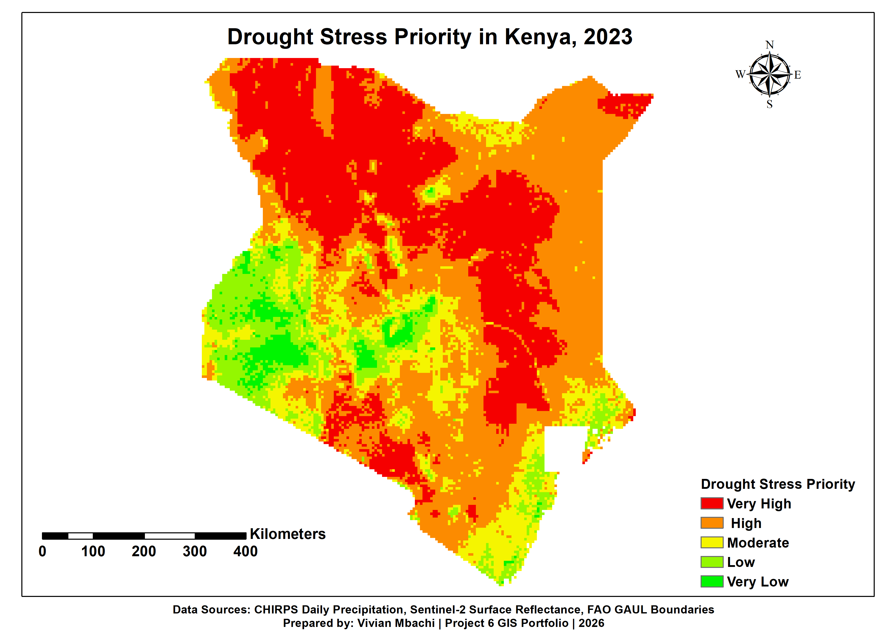
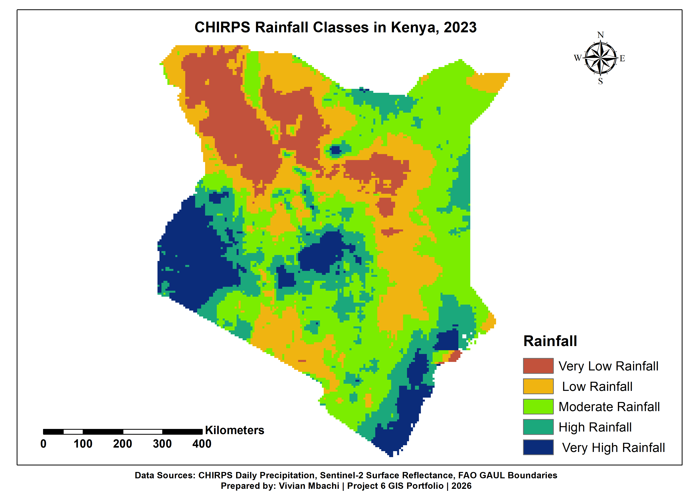
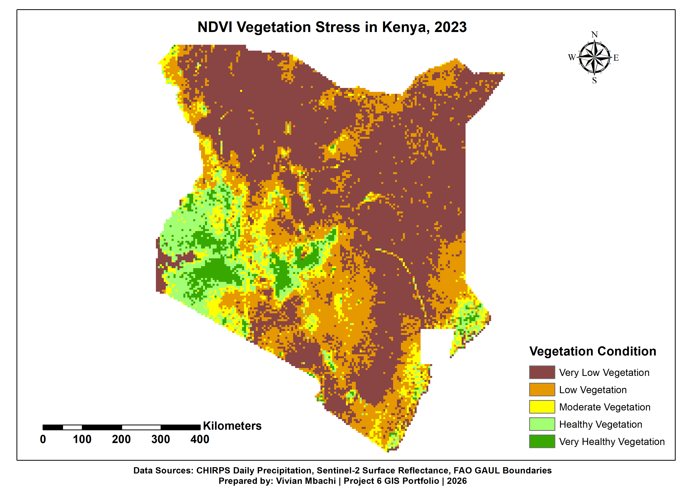
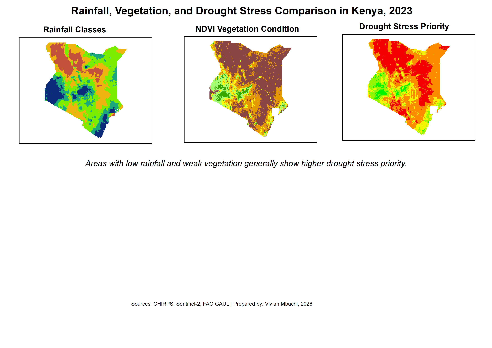

# Drought and Vegetation Stress Mapping in Kenya

**Remote-sensing analysis combining CHIRPS rainfall and Sentinel-2 NDVI to screen drought-stress priority areas across Kenya in 2023.**



## Project at a glance

| | |
|---|---|
| **Decision question** | Where did low rainfall and vegetation stress overlap in Kenya during 2023? |
| **Study area** | Kenya |
| **Tools** | Google Earth Engine and ArcMap 10.8 |
| **Data** | CHIRPS precipitation, Sentinel-2 surface reflectance, and FAO GAUL boundaries |
| **Outputs** | Four thematic maps, processed rasters, documentation, metadata, and a report |

## The challenge

Rainfall deficits and vegetation condition provide complementary views of drought stress. This project combines both indicators to create a national screening product that can support early discussion and help focus more detailed local assessment.

## Workflow

1. Prepared Kenya's analysis boundary in Google Earth Engine.
2. processed CHIRPS rainfall data for the 2023 study period.
3. processed Sentinel-2 imagery and calculated NDVI as a vegetation-condition indicator.
4. Clipped, classified, and exported the rainfall and NDVI raster outputs.
5. Combined the classified indicators into a drought-stress priority layer.
6. Styled the rasters and prepared final layouts in ArcMap 10.8.
7. Documented data sources, methods, metadata, and quality considerations.

## Featured maps

| Rainfall conditions | Vegetation stress |
|:---:|:---:|
|  |  |

| Combined drought-stress priority | Indicator comparison |
|:---:|:---:|
|  |  |

## Skills demonstrated

- Google Earth Engine raster processing
- Sentinel-2 imagery preparation and NDVI analysis
- CHIRPS rainfall analysis
- Raster masking, clipping, reclassification, and overlay
- GeoTIFF export and GIS metadata
- Thematic map design and decision-support reporting

## Deliverables

- [Final map exports](5_Maps)
- [Raw input rasters](1_Data_Raw)
- [Processed raster outputs](2_Data_Processed)
- [Workflow documentation](3_Documentation)
- [Metadata](4_Metadata)
- [Output files](6_Output)
- [Script inventory and setup notes](7_Scripts)
- [Project report](8_Report)

## Limitations and responsible use

- The outputs represent conditions for the selected 2023 analysis period and are not a current drought monitor.
- NDVI can be affected by seasonality, land cover, clouds, and image-composite choices.
- Rainfall and vegetation stress do not on their own measure household impacts, water availability, crop loss, or food insecurity.
- The priority map is a screening product. Local observations and additional climate, livelihood, and hydrological data are required before operational decisions.

## Repository structure

```text
├── 1_Data_Raw
├── 2_Data_Processed
├── 3_Documentation
├── 4_Metadata
├── 5_Maps
├── 6_Output
├── 7_Scripts
└── 8_Report
```

## Author

**Vivian Mbachi** — GIS & Data Analyst, Nairobi, Kenya  
[GitHub profile](https://github.com/viviwammbachi) · [LinkedIn](https://www.linkedin.com/in/vivianmbachi-gis)
